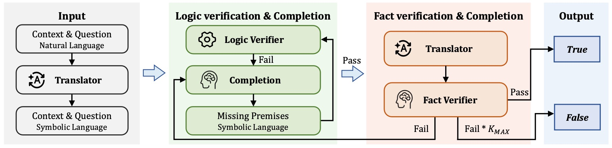

# Open-World LLM Logical Reasoning

<p align="center">
  <a href="https://github.com/OpenIKLR/OpenIKLR">
    </a>
<a href="https://openreview.net/forum?id=hEcxsQkZpW&referrer=%5BAuthor%20Console%5D(%2Fgroup%3Fid%3DICML.cc%2F2026%2FConference%2FAuthors%23your-submissions)">
    
  </a>
</p>


Codes and Data for ICML 2026 Paper:
**Open-World LLM Logical Reasoning**


## Introduction
Large Language Models (LLMs) achieve remarkable performance but struggle with complex logical reasoning, particularly in real-world settings. 
Existing research is largely confined to the closed-world assumption, which posits that all premises required for reasoning are explicitly provided. 
However, real-world tasks frequently exhibit open-world characteristics, where the provided information is insufficient to infer a conclusion due to missing premises or implicit commonsense knowledge. 
To address this, we propose OpenIKLR, an Open-world Incomplete-Knowledge-aware Logical Reasoning framework that integrates symbolic logic solvers with LLMs. 
OpenIKLR first translates natural language into symbolic representations to pinpoint reasoning gaps via a logical solver. 
It then iteratively generates a minimal set of necessary missing premises using LLMs. 
To ensure these added premises are both logically sound and factually accurate, we introduce a dual-verification: logic verification via the solver and fact verification via the LLMs. 
Experiments show that OpenIKLR consistently outperforms existing logical reasoning and RAG baselines across multiple backbones and real-world datasets. 
<p align="center">
  
</p>

## Dataset
Our open-world logical reasoning benchmark is built upon two existing logical reasoning datasets: [FOLIO](https://github.com/Yale-LILY/FOLIO) and [Multi-LogiEval](https://github.com/Mihir3009/Multi-LogiEval/tree/main). 

The benchmark contains both the original samples and their open-world versions, where part of the necessary knowledge is masked to create incomplete-knowledge reasoning scenarios.
The files are organized as follows:

```text
data/
├── FOLIO.json
└── Multi-LogiEval.json
```

## Setup
Please install the required dependencies:

```bash
pip install -r requirements.txt
```
## Translation
To translate natural language into symbolic language, please run the following command:
```bash
python "call_llm.py" \
    --input_file "data/${DATASET}.json" \
    --output_file "${MODEL}/translation/${DATASET}.json" \
    --api_key ${API_KEY} \
    --api_base_url ${API_URL} \
    --model ${MODEL} \
    --task_type "translation"
```
## Logical Verification
To check the validity of the logic, please run the following command:
```bash
python "call_solver.py" \
    --input_file "${MODEL}/translation/${DATASET}.json" \
    --output_file "${MODEL}/solver/${DATASET}.json" 
```

## LLM Completion
To complete the premise using an LLM, please run the following command:
```bash
# Initial Premise Completion (Triggered by Logic Verification Failure)
python "call_llm.py" \
    --input_file "${MODEL}/solver/${DATASET}_invalid.json" \
    --output_file "${MODEL}/completion/${DATASET}_1.json" \
    --api_key ${API_KEY} \
    --api_base_url ${API_URL} \
    --model ${MODEL} \
    --task_type "logic_completion_init"

# Iterative Premise Completion (Triggered by Logic Verification Failure)
python "call_llm.py" \
    --input_file "${MODEL}/solver/${DATASET}_1_invalid.json" \
    --output_file "${MODEL}/completion/${DATASET}_2.json" \
    --api_key ${API_KEY} \
    --api_base_url ${API_URL} \
    --model ${MODEL} \
    --task_type "logic_completion"

# Initial Premise Completion (Triggered by Fact Verification Failure)
python "call_llm.py" \
    --input_file "${MODEL}/sl2nl/${DATASET}_merge_valid_notfact.json" \
    --output_file "${MODEL}/completion/${DATASET}_merge_valid_notfact_1.json" \
    --api_key ${API_KEY} \
    --api_base_url ${API_URL} \
    --model ${MODEL} \
    --task_type "fact_completion_init"

# Iterative Premise Completion (Triggered by Fact Verification Failure)
python "call_llm.py" \
    --input_file "${MODEL}/sl2nl/${DATASET}_merge_valid_notfact_1_valid_notfact.json" \
    --output_file "${MODEL}/completion/${DATASET}_merge_valid_notfact_2.json" \
    --api_key ${API_KEY} \
    --api_base_url ${API_URL} \
    --model ${MODEL} \
    --task_type "fact_completion"
```

## Fact Verification
To verify the factual validity of the added premise, please run the following command:
```bash
python "call_llm.py" \
    --input_file "${MODEL}/solver/${DATASET}_merge_valid.json" \
    --output_file "${MODEL}/sl2nl/${DATASET}_merge_valid.json" \
    --api_key ${API_KEY} \
    --api_base_url ${API_URL} \
    --model ${MODEL} \
    --task_type "fact_verification"
```
---
Please run `bash main.sh` for the complete execution.

## Citation
If you are interested in our paper, please cite:

```bibtex
@inproceedings{mo2026open,
  title={Open-World LLM logical reasoning},
  author={Mo, Ye and Zhou, Chuan and Cheng, Fengxiang and Yu, Jialin and Pan, Liangming and Liu, Fenrong and Zhou, Sheng and Li, Haoxuan and Lin, Zhouchen and Torr, Philip},
  booktitle={Forty-third International Conference on Machine Learning},
  year={2026}
}
```

